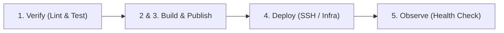

# Create CI/CD Pipeline

This skill guides the design, generation, and optimization of production-ready GitHub Actions CI/CD pipelines. By default, GitHub Actions executes jobs in parallel. This skill enforces strict sequential execution across 5 standardized stages (`verify`, `build`, `publish`, `deploy`, `observe`), preventing data leakage, race conditions, and wasted compute minutes.

---

## Core Design Criteria

Every generated workflow MUST strictly adhere to the following 5 criteria:

### Criterion 1: Explicit Trigger Declarations (Triggers)
GitHub Actions billing is calculated per runtime minute. Define precise trigger boundaries to prevent wasted compute resources:
- **Automated Triggers:** Trigger the full CI/CD pipeline only on pushes to main branches (`main`, `master`) or on Pull Requests (`pull_request`).
- **Manual Trigger:** Always include `workflow_dispatch` to enable manual triggers from the GitHub UI for on-demand runs, debugging, or emergency rollbacks.
- **Path Filtering (Optional):** Use `paths-ignore` for documentation or markdown changes (`docs/**`, `*.md`) to avoid unnecessary workflow runs.

### Criterion 2: Job Dependencies & Sequential Execution Flow (Dependencies & Flow)
Because GitHub Actions runs jobs concurrently by default, you **MUST** use the `needs` keyword to enforce strict sequential execution. If any stage fails, all subsequent stages must be immediately cancelled.
- `build` **must** declare `needs: verify`
- `publish` **must** declare `needs: build` (or combine into a consolidated `build-and-publish` job that `needs: verify`)
- `deploy` **must** declare `needs: [publish]` (or `needs: build-and-publish`)
- `observe` **must** declare `needs: deploy`



### Criterion 3: Absolute Security & Least-Privilege Permissions (Secrets & Permissions)
CI/CD workflows handle high-privilege credentials (server SSH keys, registry tokens, database URLs).
- **Never Hardcode Secrets:** All sensitive information must be referenced exclusively via GitHub Secrets: `${{ secrets.SECRET_NAME }}`.
- **Principle of Least Privilege:** Never grant blanket permissions (`permissions: write-all`). Declare explicit, minimal permissions at either the top level or per job:
  ```yaml
  permissions:
    contents: read
    packages: write # Only when pushing to GitHub Container Registry (GHCR)
  ```
- **Masking & Sanitization:** Ensure sensitive tokens are not echoed or logged in build console logs.

### Criterion 4: Execution Time Optimization & Caching (Caching)
Prolonged pipeline execution degrades team velocity. Implement multi-level caching:
- **Code Dependency Caching:** Cache package manager dependencies (e.g., `npm`, `pnpm`, `pip`, `poetry`, `maven`, `go`) in the `verify` stage using built-in setup action caching (`cache: 'npm'`, `cache: 'pip'`) or `actions/cache@v4`.
- **Docker Layer Caching:** In the build stage, use Docker Buildx with GitHub Actions Cache backend (`cache-from: type=gha`, `cache-to: type=gha,mode=max`) so only changed layers are recompiled.

### Criterion 5: Five-Stage Implementation Standards

#### Stage 1: Verify (Lint & Test)
- Pull source code with `actions/checkout@v4`.
- Set up target runtime environment (e.g., `actions/setup-node@v4`, `actions/setup-python@v5`, `actions/setup-go@v5`) with dependency caching enabled.
- Run linting (e.g., `eslint`, `flake8`, `ruff`, `golangci-lint`) and unit/integration tests (e.g., `jest`, `pytest`, `go test`).
- **Fail-Fast Rule:** If linter fails or any test breaks, execution immediately terminates.

#### Stages 2 & 3: Build & Publish (Container Image Build & Push)
- *Note:* These stages are typically combined into a single `build-and-publish` job for optimal caching and speed.
- Authenticate to the container registry using `docker/login-action@v3` (GHCR or Docker Hub).
- Set up Docker Buildx with `docker/setup-buildx-action@v3`.
- Build and push container images using `docker/build-push-action@v6`.
- **Tagging Policy:** Never rely solely on `:latest`. Tag the image with the exact commit SHA (`${{ github.sha }}`) to ensure immutability, auditability, and deterministic rollback capability.

#### Stage 4: Deploy (Deployment Execution)
- Use secure remote execution actions (e.g., `appleboy/ssh-action@v1.0.3`) to access the target production server.
- **Server Deployment Script:**
  1. Authenticate server to container registry (if private).
  2. Pull the newly published image using the exact commit SHA: `docker pull ghcr.io/<owner>/<image>:${{ github.sha }}`.
  3. Update container configuration or compose environment (`IMAGE_TAG=${{ github.sha }}`).
  4. Perform zero-downtime or graceful restart: `docker compose up -d --remove-orphans`.
  5. Prune dangling/old images: `docker image prune -f`.

#### Stage 5: Observe (Automated Health Check & Acceptance)
- Deployment completion does not prove application health. This stage validates runtime responsiveness.
- Use `curl` or HTTP request actions with built-in retry mechanisms against the production `/health` or readiness endpoint.
- Verify that the endpoint returns `HTTP 200 OK` within a bounded timeout (e.g., 5 retries with 10-second intervals).
- The workflow succeeds (green checkmark) **only** if the health check passes.

---

## Standard Operating Procedure (SOP)

Follow these steps when generating or refactoring a CI/CD workflow:

1. **Analyze Project Ecosystem:**
   - Detect repository runtime, package manager, and test suites.
   - Determine target container registry (GHCR vs Docker Hub) and hosting target (Linux VPS, AWS EC2, Kubernetes, Cloud Run).
2. **Define Triggers & Base Permissions:**
   - Add `on: push`, `on: pull_request`, and `on: workflow_dispatch`.
   - Set top-level `permissions: contents: read`.
3. **Draft the 5 Sequential Jobs:**
   - `verify`: Check out, setup language, cache dependencies, run linter and test suite.
   - `build-and-publish`: `needs: verify`, login to registry, buildx with GHA cache, push tagged with `${{ github.sha }}` and `latest`.
   - `deploy`: `needs: build-and-publish`, SSH into server, pull `${{ github.sha }}`, recreate containers.
   - `observe`: `needs: deploy`, poll `/health` endpoint with retry loop until HTTP 200 or timeout.
4. **Audit Security & Environment Variables:**
   - Verify all credentials use `${{ secrets.* }}`.
   - Ensure environment variables are scoped to the required job or step.
5. **Output Workflow File:**
   - Place the finalized YAML in `.github/workflows/deploy.yml` (or `.github/workflows/ci-cd.yml`).

---

## Production Reference Template

Below is a complete, production-grade GitHub Actions CI/CD template implementing the 5-stage sequential standard with GHCR, Docker Buildx, SSH deployment, and health check observation.

```yaml
name: CI/CD Production Pipeline

on:
  push:
    branches:
      - main
      - master
    paths-ignore:
      - 'README.md'
      - 'docs/**'
      - '.gitignore'
  pull_request:
    branches:
      - main
      - master
  workflow_dispatch:

permissions:
  contents: read
  packages: write

env:
  REGISTRY: ghcr.io
  IMAGE_NAME: ${{ github.repository }}

jobs:
  # ---------------------------------------------------------------------------
  # Stage 1: Verify (Lint & Test)
  # ---------------------------------------------------------------------------
  verify:
    name: 1. Verify (Lint & Test)
    runs-on: ubuntu-latest
    steps:
      - name: Check out repository
        uses: actions/checkout@v4

      - name: Set up Node.js runtime
        uses: actions/setup-node@v4
        with:
          node-version: 20
          cache: 'npm'

      - name: Install dependencies
        run: npm ci

      - name: Run Linter
        run: npm run lint

      - name: Run Unit & Integration Tests
        run: npm test -- --coverage

  # ---------------------------------------------------------------------------
  # Stage 2 & 3: Build & Publish (Docker Buildx + Registry Push)
  # ---------------------------------------------------------------------------
  build-and-publish:
    name: 2 & 3. Build & Publish Image
    runs-on: ubuntu-latest
    needs: verify
    if: github.event_name == 'push' || github.event_name == 'workflow_dispatch'
    outputs:
      image_tag: ${{ steps.meta.outputs.version }}
    steps:
      - name: Check out repository
        uses: actions/checkout@v4

      - name: Set up Docker Buildx
        uses: docker/setup-buildx-action@v3

      - name: Log in to GitHub Container Registry
        uses: docker/login-action@v3
        with:
          registry: ${{ env.REGISTRY }}
          username: ${{ github.actor }}
          password: ${{ secrets.GITHUB_TOKEN }}

      - name: Extract Docker metadata
        id: meta
        uses: docker/metadata-action@v5
        with:
          images: ${{ env.REGISTRY }}/${{ env.IMAGE_NAME }}
          tags: |
            type=sha,format=long,prefix=
            type=raw,value=latest,enable={{is_default_branch}}

      - name: Build and push Docker image
        uses: docker/build-push-action@v6
        with:
          context: .
          push: true
          tags: ${{ steps.meta.outputs.tags }}
          labels: ${{ steps.meta.outputs.labels }}
          cache-from: type=gha
          cache-to: type=gha,mode=max

  # ---------------------------------------------------------------------------
  # Stage 4: Deploy (Production Server Execution via SSH)
  # ---------------------------------------------------------------------------
  deploy:
    name: 4. Deploy to Production
    runs-on: ubuntu-latest
    needs: build-and-publish
    if: github.event_name == 'push' || github.event_name == 'workflow_dispatch'
    steps:
      - name: Execute remote deployment commands via SSH
        uses: appleboy/ssh-action@v1.0.3
        with:
          host: ${{ secrets.PROD_SERVER_HOST }}
          username: ${{ secrets.PROD_SERVER_USER }}
          key: ${{ secrets.PROD_SSH_PRIVATE_KEY }}
          port: ${{ secrets.PROD_SSH_PORT || 22 }}
          script: |
            echo "Logging into container registry on target server..."
            echo "${{ secrets.GITHUB_TOKEN }}" | docker login ${{ env.REGISTRY }} -u ${{ github.actor }} --password-stdin
            
            cd /opt/app || exit 1
            
            echo "Pulling image tag: ${{ github.sha }}..."
            export APP_IMAGE="${{ env.REGISTRY }}/${{ env.IMAGE_NAME }}:${{ github.sha }}"
            docker pull "$APP_IMAGE"
            
            echo "Deploying container update..."
            IMAGE_TAG="${{ github.sha }}" docker compose up -d --remove-orphans
            
            echo "Cleaning up dangling images..."
            docker image prune -f

  # ---------------------------------------------------------------------------
  # Stage 5: Observe (Health Check & Runtime Verification)
  # ---------------------------------------------------------------------------
  observe:
    name: 5. Observe & Health Check
    runs-on: ubuntu-latest
    needs: deploy
    if: github.event_name == 'push' || github.event_name == 'workflow_dispatch'
    steps:
      - name: Verify application endpoint health
        run: |
          TARGET_URL="${{ secrets.PROD_APP_URL }}/health"
          MAX_RETRIES=6
          RETRY_DELAY=10
          
          echo "Starting health check verification for: $TARGET_URL"
          
          for i in $(seq 1 $MAX_RETRIES); do
            HTTP_STATUS=$(curl -s -o /dev/null -w "%{http_code}" --max-time 5 "$TARGET_URL" || echo "000")
            echo "Attempt $i/$MAX_RETRIES: HTTP Status Code is $HTTP_STATUS"
            
            if [ "$HTTP_STATUS" -eq 200 ]; then
              echo "✅ Health check PASSED! Application is alive and responding with 200 OK."
              exit 0
            fi
            
            echo "Waiting $RETRY_DELAY seconds before next check..."
            sleep $RETRY_DELAY
          done
          
          echo "❌ Health check FAILED after $MAX_RETRIES attempts. Application is not responding with HTTP 200 OK."
          exit 1
```

---

## Decision Tree

Use this decision tree to adapt the pipeline for different configurations:

* **Registry Selection:**
  * **GitHub Container Registry (GHCR):** Set `registry: ghcr.io`, use `${{ secrets.GITHUB_TOKEN }}` with `packages: write`.
  * **Docker Hub:** Set `registry: docker.io`, use `${{ secrets.DOCKERHUB_USERNAME }}` and `${{ secrets.DOCKERHUB_TOKEN }}`.
* **Deployment Target:**
  * **Self-hosted VPS / Bare Metal / EC2:** Use `appleboy/ssh-action` with SSH private keys and `docker compose up -d`.
  * **AWS ECS / ECR:** Replace `deploy` with `aws-actions/amazon-ecs-deploy-task-definition`.
  * **Kubernetes:** Replace `deploy` with `azure/k8s-set-context` and `kubectl set image`.
* **Pull Request vs Branch Push:**
  * For PR runs: Execute only `verify` (and optionally build without push) by adding condition `if: github.event_name == 'push' || github.event_name == 'workflow_dispatch'` to `build-and-publish`, `deploy`, and `observe`.

---

## Checklists & Best Practices

* **Pipeline Flow & Concurrency:**
  * Always use `needs` to prevent race conditions and out-of-order execution.
  * Use GitHub Actions `concurrency` groups to cancel outdated in-flight builds on the same branch:
    ```yaml
    concurrency:
      group: ${{ github.workflow }}-${{ github.ref }}
      cancel-in-progress: true
    ```
* **Security & Secret Handling:**
  * Never commit `.env` or credential files to source control.
  * Use secret variables for hosts, ports, keys, and base URLs.
  * Pin action versions to full SHA or trusted major tags (`v4`, `v3`).
* **Caching Efficiency:**
  * Leverage `actions/cache` or setup action cache flags (`cache: 'pip'`, `cache: 'npm'`).
  * Ensure `cache-to: type=gha,mode=max` is configured for Docker Buildx.
* **Observability & Rollback:**
  * Always verify that the deployment terminates in an active `/health` check.
  * Use `${{ github.sha }}` image tags to make rollbacks instantaneous by redeploying the previous commit SHA.

---

## Review Checklist

Before delivering or committing a CI/CD pipeline, verify:
- [ ] Are triggers explicitly defined for automated pushes, pull requests, and manual `workflow_dispatch`?
- [ ] Are jobs chained sequentially using `needs` (`build` -> `publish` -> `deploy` -> `observe`)?
- [ ] Are permissions explicitly scoped with least privileges (e.g. `packages: write`, no `write-all`)?
- [ ] Are all sensitive credentials retrieved via `${{ secrets.SECRET_NAME }}` with zero hardcoded values?
- [ ] Is dependency caching enabled in the `verify` stage?
- [ ] Is Docker Buildx caching (`type=gha`) enabled for container builds?
- [ ] Are Docker images tagged with the commit SHA (`${{ github.sha }}`)?
- [ ] Does the `observe` stage verify endpoint health with a timeout/retry loop and fail if status != 200?
